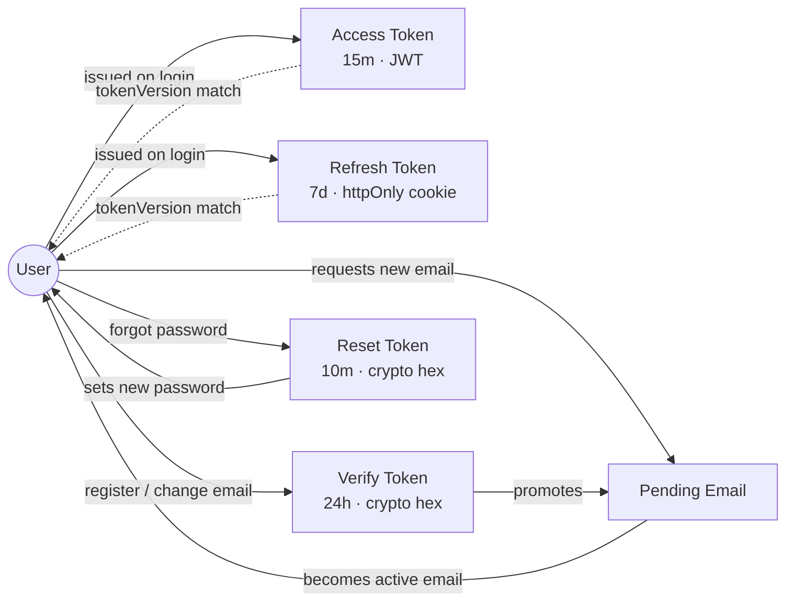
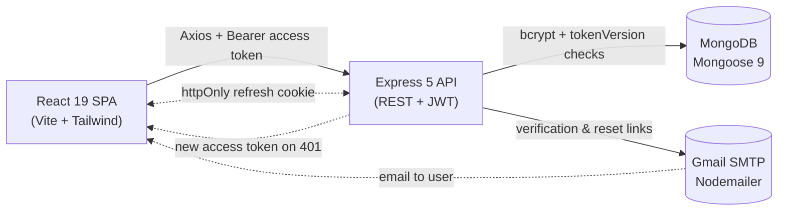

<div align="center">

  <p>
    <strong>🔐 User Authentication System</strong>
  </p>

  <h1>User Authentication System</h1>

  <p><em>A full-stack MERN authentication system with JWT access/refresh tokens, server-side session revocation, email verification, password reset, and a modern React + Tailwind UI.</em></p>

  <p>
    
    
    
    
    
    
    
    
    
  </p>

  <p>
    <a href="https://user-authentication-systemm.netlify.app/">Live Demo</a> •
    <a href="#features">Features</a> •
    <a href="#installation">Quick Start</a> •
    <a href="#api-endpoints">API Docs</a> •
    <a href="#architecture">Architecture</a>
  </p>

</div>

---

## Features

- **User Authentication** — Secure register and login system with JWT-based dual-token (access + refresh) authentication
- **Email Verification** — New accounts must verify their email address before accessing protected resources (24h token expiry)
- **Automatic Token Refresh** — Axios interceptor with request queuing silently refreshes expired access tokens without interrupting the user
- **Forgot & Reset Password** — Email-based password reset flow with 10-minute token expiry and email enumeration prevention
- **Server-Side Session Revocation** — A per-user `tokenVersion` invalidates every issued access/refresh token on logout, password change, and password reset
- **Lockout-Free Email Change** — A pending-email flow keeps the current email active until the new address is verified
- **Profile Management** — Update name, change email (via pending-email verification), and change password with current password confirmation
- **Password Strength Indicator** — Real-time visual feedback with a rule checklist on registration and reset forms
- **Protected & Guest Routes** — Frontend route guards redirect users based on authentication state
- **Toast Notification System** — Context-based toast notifications with auto-dismiss for success, error, and info messages
- **Responsive UI** — Mobile-first design with a hamburger navigation menu and a consistent component library
- **Three-Tier Rate Limiting** — Global, auth-route, and sensitive-endpoint rate limiters to prevent brute-force attacks
- **Input Validation & Sanitization** — Server-side validation with express-validator on all endpoints
- **NoSQL Injection Protection** — express-mongo-sanitize strips MongoDB operators from user input
- **Interactive API Docs** — Swagger UI served at `/api-docs` from OpenAPI 3 JSDoc annotations
- **Centralized Error Handling** — Custom `AppError` class with Mongoose and JWT error mapping and clean JSON responses
- **Graceful Shutdown** — Proper HTTP server and MongoDB connection cleanup on process signals
- **Tested** — 71 automated tests across backend (Jest + Supertest) and frontend (Vitest + React Testing Library)

---

## Live Demo

[🚀 View Live Demo](https://user-authentication-systemm.netlify.app/)

> The interactive API documentation (Swagger UI) is available at `/api-docs` on the backend server.

---

## Architecture

A high-level visual map of the system. Both diagrams render natively on GitHub thanks to Mermaid support.

### Domain Model

The system centers on a single `User` document. The diagram below shows how authentication artifacts relate to it and how the `tokenVersion` guard ties tokens back to the user.



### Request Lifecycle

How a single browser action travels through the stack.



---

## Technologies

### Frontend

- **React 19**: Modern UI library with hooks and context for state management
- **Vite 8**: Lightning-fast build tool and development server with HMR
- **Tailwind CSS 4**: Utility-first CSS framework for rapid, responsive styling
- **React Router 7**: Declarative client-side routing with nested layouts
- **Axios 1.14**: Promise-based HTTP client with interceptor support

### Backend

- **Node.js**: Server-side JavaScript runtime
- **Express 5**: Minimal and flexible web application framework
- **MongoDB (Mongoose 9)**: NoSQL database with elegant object modeling and schema validation
- **JWT (jsonwebtoken)**: Stateless authentication with a dual access/refresh token strategy
- **bcryptjs 3**: Password hashing with configurable salt rounds (12)
- **Nodemailer 8**: Email delivery via Gmail SMTP with HTML templates
- **Helmet 8**: Security headers middleware
- **express-rate-limit 8**: Tiered rate limiting for API protection
- **express-validator 7**: Request validation and sanitization chains
- **express-mongo-sanitize 2**: NoSQL injection prevention
- **swagger-jsdoc + swagger-ui-express**: OpenAPI 3 docs generated from JSDoc annotations

### Testing

- **Jest 30**: Backend test framework with 35 integration tests
- **Supertest 7**: HTTP assertions for Express endpoint testing
- **MongoDB Memory Server**: In-memory MongoDB instance for isolated test runs
- **Vitest 4**: Frontend test framework with 36 unit tests
- **React Testing Library 16**: Component testing with DOM assertions
- **Testing Library Jest DOM**: Custom matchers for DOM state

---

## Installation

### Prerequisites

- **Node.js** v18+ and **npm**
- **MongoDB** — [MongoDB Atlas](https://www.mongodb.com/atlas) (free tier) or a local instance
- **Gmail account** with an [App Password](https://support.google.com/accounts/answer/185833) enabled (optional — emails are logged to the console if SMTP is not configured)

### Local Development

**1. Clone the repository:**

```bash
git clone https://github.com/Serkanbyx/user-authentication-system.git
cd user-authentication-system
```

**2. Set up environment variables:**

```bash
cp server/.env.example server/.env
cp client/.env.example client/.env
```

**server/.env**

```env
# Application
NODE_ENV=development
PORT=5000

# Database
MONGODB_URI=mongodb+srv://<username>:<password>@cluster.mongodb.net/<dbname>

# JWT Secrets (generate unique random strings for each)
ACCESS_TOKEN_SECRET=your-access-token-secret-64-chars
REFRESH_TOKEN_SECRET=your-refresh-token-secret-64-chars

# Token Expiry
ACCESS_TOKEN_EXPIRE=15m
REFRESH_TOKEN_EXPIRE=7d

# Client URL (for CORS & email links)
CLIENT_URL=http://localhost:5173

# Email (Gmail SMTP with App Password — optional)
EMAIL_HOST=smtp.gmail.com
EMAIL_PORT=587
EMAIL_USER=your-email@gmail.com
EMAIL_PASS=your-app-password
EMAIL_FROM=Auth System <noreply@yourapp.com>
```

**client/.env**

```env
VITE_API_URL=http://localhost:5000
```

**3. Install dependencies:**

```bash
# From the repository root — installs both server and client
npm run install:all

# …or install each workspace manually
cd server && npm install
cd ../client && npm install
```

**4. Run the application:**

```bash
# Terminal 1 — Backend
cd server && npm run dev

# Terminal 2 — Frontend
cd client && npm run dev
```

The backend runs on `http://localhost:5000` and the frontend on `http://localhost:5173`.

**5. Run tests:**

```bash
# Backend tests (Jest + Supertest)
cd server && npm test

# Frontend tests (Vitest + React Testing Library)
cd client && npm test
```

---

## Usage

1. **Register** — Create a new account with your name, email, and a strong password (a real-time strength indicator guides you)
2. **Verify Email** — Check your inbox and click the verification link (valid for 24 hours)
3. **Login** — Sign in with your verified credentials; a short-lived access token and an httpOnly refresh cookie are issued
4. **Dashboard** — View and update your profile information, change your email (verified via the pending-email flow), or change your password
5. **Forgot Password** — Request a password reset link from the login page; the link expires in 10 minutes
6. **Logout** — End your session; the refresh cookie is cleared and the session is revoked server-side

---

## How It Works?

### Authentication Flow

```
┌─────────┐         ┌─────────────┐         ┌──────────┐
│  Client  │         │   Express   │         │ MongoDB  │
│  (React) │         │   Server    │         │  Atlas   │
└────┬─────┘         └──────┬──────┘         └────┬─────┘
     │  POST /register      │                     │
     │─────────────────────>│  Hash password       │
     │                      │  Generate verify     │
     │                      │  token               │
     │                      │────────────────────> │ Save user
     │                      │──── Send email ────> │ (Nodemailer)
     │  201 "Check email"   │                     │
     │<─────────────────────│                     │
     │  GET /verify/:token  │                     │
     │─────────────────────>│────────────────────>│ isVerified = true
     │  200 "Verified"      │                     │
     │<─────────────────────│                     │
     │  POST /login         │                     │
     │─────────────────────>│  Validate creds     │
     │                      │  Generate tokens    │
     │  Access token (JSON) │                     │
     │  Refresh token       │                     │
     │  (httpOnly cookie)   │                     │
     │<─────────────────────│                     │
     │  GET /profile        │                     │
     │  Bearer <access>     │─────────────────────>│ Fetch user
     │  200 User data       │  Verify JWT +       │
     │<─────────────────────│  tokenVersion       │
     │  POST /refresh       │                     │
     │  (cookie sent auto)  │─────────────────────>│ Verify refresh JWT
     │  New access token    │                     │
     │<─────────────────────│                     │
     │  POST /logout        │                     │
     │─────────────────────>│  Bump tokenVersion  │
     │  200 "Logged out"    │  Clear cookie       │
     │<─────────────────────│                     │
```

### Dual-Token Strategy with Server-Side Revocation

The system uses two separate tokens to balance security with user experience:

- **Access Token (15 min)** — Short-lived JWT stored in `localStorage`, sent via the `Authorization: Bearer` header. Even if compromised, the window of abuse is narrow.
- **Refresh Token (7 days)** — Long-lived JWT locked in an `httpOnly` cookie with `secure` and `sameSite` flags. Used only to request new access tokens — never sent to resource endpoints.

This architecture allows stateless authentication without a server-side session store while limiting the blast radius of a token compromise. A per-user `tokenVersion` is embedded in **both** tokens and verified on every request; incrementing it (on logout, password change, or password reset) instantly revokes all previously issued tokens.

### Automatic Token Refresh (Axios Interceptor)

When an API request returns `401`, the Axios response interceptor automatically attempts to refresh the access token. A request queue prevents race conditions when multiple requests fail simultaneously:

```javascript
api.interceptors.response.use(
  (response) => response,
  async (error) => {
    const originalRequest = error.config;

    const isRefreshRequest = originalRequest.url === '/api/auth/refresh';
    if (error.response?.status !== 401 || originalRequest._retry || isRefreshRequest) {
      return Promise.reject(error);
    }

    if (isRefreshing) {
      return new Promise((resolve, reject) => {
        failedQueue.push({ resolve, reject });
      }).then((token) => {
        originalRequest.headers.Authorization = `Bearer ${token}`;
        return api(originalRequest);
      });
    }

    originalRequest._retry = true;
    isRefreshing = true;

    const { data } = await api.post('/api/auth/refresh');
    localStorage.setItem('accessToken', data.accessToken);
    processQueue(null, data.accessToken);
    return api(originalRequest);
  }
);
```

### Lockout-Free Email Change

When a user changes their email, the new address is stored in a `pendingEmail` field and a verification link is sent to it. The **current** email stays active (and the account stays verified) until the new address is confirmed — so a typo or an inaccessible inbox never locks the user out. On verification, the pending email is promoted to the active email.

---

## API Endpoints

### Auth Routes — `/api/auth`

| Method | Endpoint                          | Auth | Description                                        |
| ------ | --------------------------------- | ---- | -------------------------------------------------- |
| POST   | `/api/auth/register`              | No   | Create a new user and send a verification email    |
| GET    | `/api/auth/verify/:token`         | No   | Verify user email with a token                     |
| POST   | `/api/auth/login`                 | No   | Authenticate user and receive JWT + refresh cookie |
| POST   | `/api/auth/refresh`               | No   | Refresh access token using the httpOnly cookie     |
| POST   | `/api/auth/logout`                | No   | Revoke the session and clear the refresh cookie    |
| POST   | `/api/auth/forgot-password`       | No   | Send a password reset email (rate limited)         |
| POST   | `/api/auth/reset-password/:token` | No   | Reset password using a token (rate limited)        |

### User Routes — `/api/users`

| Method | Endpoint                     | Auth | Description                                         |
| ------ | ---------------------------- | ---- | --------------------------------------------------- |
| GET    | `/api/users/profile`         | Yes  | Get the authenticated user's profile data           |
| PUT    | `/api/users/profile`         | Yes  | Update name and/or email (email uses pending-email) |
| PUT    | `/api/users/change-password` | Yes  | Change password with current password confirmation  |

### Health & Docs

| Method | Endpoint      | Auth | Description                              |
| ------ | ------------- | ---- | ---------------------------------------- |
| GET    | `/api/health` | No   | Returns `{ status: 'ok', timestamp }`    |
| GET    | `/api-docs`   | No   | Interactive Swagger UI (OpenAPI 3)       |

> Authenticated endpoints require an `Authorization: Bearer <token>` header.

---

## Project Structure

A clean monorepo layout with an explicit backend / frontend split. Each panel below is collapsible — expand the one you care about.

<details open>
<summary><b>Server</b> — Express 5 API</summary>

```
server/
├── src/
│   ├── config/          # env validation, db connection, swagger spec
│   ├── controllers/     # authController, userController
│   ├── middlewares/     # AppError, auth (JWT + tokenVersion), errorHandler, rateLimiter, validate
│   ├── models/          # User schema with bcrypt hook, pendingEmail & tokenVersion
│   ├── routes/          # authRoutes, userRoutes (with Swagger JSDoc)
│   ├── utils/           # tokenUtils, cookieOptions, sendEmail (+ templates)
│   ├── views/           # landing.html
│   └── app.js           # Express app composition + middleware chain
├── tests/               # auth.test.js, user.test.js, setup.js (MongoMemoryServer)
├── server.js            # Entry point — env validation, DB connect, graceful shutdown
├── .env.example
└── package.json
```

</details>

<details>
<summary><b>Client</b> — React 19 + Vite SPA</summary>

```
client/
├── public/              # favicon, _redirects (Netlify SPA rule)
├── src/
│   ├── api/             # Axios instance with interceptors
│   ├── assets/          # hero image
│   ├── components/      # GuestRoute, ProtectedRoute, ui/ (Button, Input, Card…)
│   ├── context/         # AuthContext, ToastContext
│   ├── hooks/           # useAuth, useToast
│   ├── layouts/         # AppLayout (navbar + content)
│   ├── pages/           # Home, Login, Register, Dashboard, VerifyEmail…
│   ├── tests/           # components.test.jsx, passwordValidation.test.js, setup.js
│   ├── utils/           # passwordValidation (rules + strength)
│   ├── App.jsx          # router configuration
│   ├── main.jsx         # React entry point + providers
│   └── index.css        # Tailwind imports
├── netlify.toml
├── .env.example
└── package.json
```

</details>

<details>
<summary><b>Repository root</b> — governance & deployment</summary>

```
user-authentication-system/
├── client/              # → see Client panel above
├── server/              # → see Server panel above
├── .github/             # issue templates, PR template, CODE_OF_CONDUCT, CONTRIBUTING, SECURITY
├── render.yaml          # Render deployment blueprint
├── package.json         # Root workspace scripts (dev:server, dev:client, install:all)
├── LICENSE
└── README.md
```

</details>

---

## Security

- **Server-Side Token Revocation** — A per-user `tokenVersion` embedded in every token is verified on each request; logout, password change, and password reset increment it to instantly invalidate all outstanding tokens
- **Lockout-Free Email Change** — New emails are held in a `pendingEmail` field and only activated after verification, so the active email (and access) is never disrupted
- **Helmet** — Sets security-related HTTP headers (CSP, X-Frame-Options, HSTS, etc.)
- **CORS Whitelist** — Only the configured `CLIENT_URL` origin is allowed with credentials
- **Three-Tier Rate Limiting** — Global (100 req/15min), auth routes (10 req/15min), and sensitive endpoints (5 req/hour)
- **Password Hashing** — bcryptjs with 12 salt rounds (OWASP recommended minimum is 10)
- **httpOnly Cookies** — Refresh tokens stored in httpOnly cookies, inaccessible to JavaScript/XSS
- **Secure & SameSite Cookies** — `secure: true` and `sameSite: none` in production to mitigate CSRF
- **Input Validation** — All endpoints validated with express-validator chains (email, password strength, token format)
- **NoSQL Injection Prevention** — express-mongo-sanitize strips `$` and `.` operators from user input
- **Email Enumeration Prevention** — Forgot-password always returns the same response regardless of email existence
- **Request Body Limit** — JSON body capped at 10kb to prevent payload abuse
- **Sensitive Fields Hidden** — Password, tokens, and expiry dates excluded from query results via Mongoose `select: false`
- **Centralized Error Handling** — Production mode hides stack traces and never leaks internal details for unexpected errors
- **Graceful Shutdown** — SIGTERM/SIGINT handlers close the HTTP server and MongoDB connection properly
- **Trust Proxy** — Enabled in production for correct client IP detection behind reverse proxies (rate limiting accuracy)

---

## Deployment

### Backend — Render

1. Create a new **Web Service** on [Render](https://render.com)
2. Connect your GitHub repository
3. Configure:
   - **Root Directory:** `server`
   - **Build Command:** `npm install`
   - **Start Command:** `node server.js`
4. Set environment variables in the Render dashboard:

| Variable               | Value                                |
| ---------------------- | ------------------------------------ |
| `NODE_ENV`             | `production`                         |
| `MONGODB_URI`          | Your MongoDB Atlas connection string |
| `ACCESS_TOKEN_SECRET`  | Random 64-character string           |
| `REFRESH_TOKEN_SECRET` | Different random 64-character string |
| `ACCESS_TOKEN_EXPIRE`  | `15m`                                |
| `REFRESH_TOKEN_EXPIRE` | `7d`                                 |
| `CLIENT_URL`           | Your Netlify frontend URL            |
| `EMAIL_HOST`           | `smtp.gmail.com`                     |
| `EMAIL_PORT`           | `587`                                |
| `EMAIL_USER`           | Your Gmail address                   |
| `EMAIL_PASS`           | Your Gmail App Password              |
| `EMAIL_FROM`           | `Auth System <noreply@yourapp.com>`  |

> A `render.yaml` blueprint is included in the repository for one-click deployment.

### Frontend — Netlify

1. Create a new site on [Netlify](https://netlify.com)
2. Connect your GitHub repository
3. Configure:
   - **Base Directory:** `client`
   - **Build Command:** `npm run build`
   - **Publish Directory:** `client/dist`
4. Set the environment variable:

| Variable       | Value                                                           |
| -------------- | --------------------------------------------------------------- |
| `VITE_API_URL` | Your Render backend URL (e.g., `https://your-app.onrender.com`) |

> The `netlify.toml` and `_redirects` files are already configured for SPA routing.

### Post-Deployment Checklist

- [ ] Test the full registration → email verification → login flow
- [ ] Verify cookies are `secure` and `httpOnly` in browser DevTools
- [ ] Confirm CORS only allows your frontend origin
- [ ] Test rate limiting by hitting auth endpoints rapidly
- [ ] Verify forgot-password returns a generic message for non-existent emails
- [ ] Test token refresh after access token expiry
- [ ] Confirm logout and password change revoke the session server-side

---

## Features in Detail

### Completed Features

- ✅ JWT access + refresh token authentication
- ✅ Server-side session revocation via `tokenVersion`
- ✅ Email verification with 24-hour token expiry
- ✅ Lockout-free email change via pending-email flow
- ✅ Forgot & reset password with 10-minute token expiry
- ✅ Profile management (name, email, password)
- ✅ Password strength indicator with real-time feedback
- ✅ Axios interceptor with silent token refresh and request queuing
- ✅ Protected and guest route guards
- ✅ Toast notification system (success, error, info)
- ✅ Responsive design with a mobile hamburger menu
- ✅ Three-tier rate limiting (global, auth, sensitive)
- ✅ Centralized error handling with Mongoose/JWT error mapping
- ✅ Reusable UI component library (Button, Input, Card, Alert, Spinner, Toast, PasswordStrengthIndicator)
- ✅ Interactive Swagger API documentation
- ✅ Email enumeration prevention
- ✅ Graceful server shutdown
- ✅ Deployment configs (Render + Netlify)
- ✅ Backend integration tests (Jest + Supertest — 35 tests)
- ✅ Frontend unit tests (Vitest + React Testing Library — 36 tests)

### Future Features

- [ ] 🔮 OAuth 2.0 social login (Google, GitHub)
- [ ] 🔮 Two-factor authentication (2FA)
- [ ] 🔮 Account deletion
- [ ] 🔮 Session management (view and revoke individual active sessions)
- [ ] 🔮 Admin dashboard with user management

---

## Contributing

Contributions are welcome! Please read our [Contributing Guide](.github/CONTRIBUTING.md) and [Code of Conduct](.github/CODE_OF_CONDUCT.md) before getting started.

1. **Fork** the repository
2. **Create** a feature branch (`git checkout -b feat/amazing-feature`)
3. **Commit** your changes using the conventional commit format
4. **Push** to the branch (`git push origin feat/amazing-feature`)
5. **Open** a Pull Request

### Commit Message Format

| Prefix      | Description                        |
| ----------- | ---------------------------------- |
| `feat:`     | New feature                        |
| `fix:`      | Bug fix                            |
| `refactor:` | Code refactoring                   |
| `docs:`     | Documentation changes              |
| `chore:`    | Maintenance and dependency updates |

---

## License

This project is licensed under the [MIT License](./LICENSE).

---

## Developer

**Serkanby**

- 🌐 Website: [serkanbayraktar.com](https://serkanbayraktar.com/)
- 🐙 GitHub: [@Serkanbyx](https://github.com/Serkanbyx)
- 📧 Email: [serkanbyx1@gmail.com](mailto:serkanbyx1@gmail.com)

---

## Contact

- [Open an Issue](https://github.com/Serkanbyx/user-authentication-system/issues)
- Email: [serkanbyx1@gmail.com](mailto:serkanbyx1@gmail.com)
- Website: [serkanbayraktar.com](https://serkanbayraktar.com/)

---

⭐ If you like this project, don't forget to give it a star!
