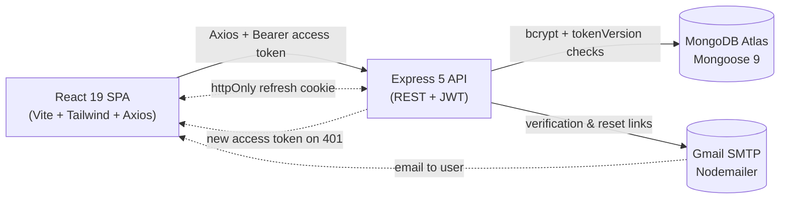

# User Authentication System — Step-by-Step Build Guide

> **Archived: original build playbook.** This guide is the original roadmap used to build the User Authentication System. It is preserved as a making-of narrative; the codebase may have evolved since the guide was written (for example, server-side session revocation via `tokenVersion` and the lockout-free pending-email flow were added after the initial roadmap). For current setup, architecture, and deployment notes, see [../README.md](../README.md).

---

> **Project Summary:** A full-stack MERN authentication system. Users register, verify their email, log in, manage their profile, and reset forgotten passwords. Authentication uses a dual-token strategy — a short-lived JWT access token sent via the `Authorization` header and a long-lived refresh token stored in an `httpOnly` cookie — backed by a per-user `tokenVersion` for server-side revocation on logout, password change, and password reset. Security layers include Helmet headers, a CORS whitelist, three-tier rate limiting, bcrypt password hashing (12 rounds), express-validator input validation, NoSQL injection sanitization, and email enumeration prevention. The stack is Node.js + Express 5 + MongoDB (Mongoose 9) on the backend and React 19 + Vite 8 + Tailwind CSS 4 on the frontend, with Jest/Supertest and Vitest/React Testing Library test suites and Render + Netlify deployment.

Each step below is a self-contained prompt. Execute them in order.

Stack: Node.js, Express 5, MongoDB (Mongoose 9), JWT, bcryptjs, Nodemailer, Helmet, express-rate-limit, express-validator, Swagger; React 19, Vite 8, Tailwind CSS 4, React Router 7, Axios; Jest, Supertest, mongodb-memory-server, Vitest, React Testing Library.

---

## Table of Contents

**PHASE 1 — Backend Foundation**

- STEP 1 — Project Scaffolding & Dependency Setup
- STEP 2 — Environment Validation & Database Connection
- STEP 3 — Express App, Server Entry & Graceful Shutdown
- STEP 4 — Error Handling (AppError + Central Handler)
- STEP 5 — User Model (Schema, Hashing, tokenVersion, pendingEmail)
- STEP 6 — Token & Cookie Utilities
- STEP 7 — Email Service (Nodemailer + Templates)

**PHASE 2 — Backend Resources**

- STEP 8 — Validation Chains & Rate Limiters
- STEP 9 — Auth Middleware (JWT + tokenVersion Guard)
- STEP 10 — Auth Controller & Routes
- STEP 11 — User Controller & Routes
- STEP 12 — Swagger / OpenAPI Documentation
- STEP 13 — Backend Integration Tests

**PHASE 3 — Client Foundation**

- STEP 14 — Client Scaffolding (Vite + Tailwind)
- STEP 15 — Axios Instance with Refresh Interceptor
- STEP 16 — Auth & Toast Contexts + Hooks
- STEP 17 — Routing, Layout & Route Guards
- STEP 18 — Reusable UI Component Library

**PHASE 4 — Client Pages**

- STEP 19 — Home & NotFound
- STEP 20 — Register & Login
- STEP 21 — Verify Email
- STEP 22 — Forgot & Reset Password
- STEP 23 — Dashboard (Profile & Password)

**PHASE 5 — Polish & Deploy**

- STEP 24 — Password Validation Utility & Frontend Tests
- STEP 25 — Deployment Configs (Render + Netlify)
- STEP 26 — Security Hardening & Pre-Flight Review

**Appendices**

- Appendix A — Shared Constants & Environment Variables
- Appendix B — Common Patterns (Response Shape, AppError, tokenVersion)
- Appendix C — Pre-Flight Checklist & Common Pitfalls

---

## Global Build Rules (apply to EVERY step)

- **No git operations.** Do not run, suggest, or automate any `git` commands (no `add`, `commit`, `push`, `branch`, `merge`, `rebase`). Version control is handled manually by the user.
- **No unapproved packages.** Install only the dependencies listed in a step. Prefer native methods over new dependencies.
- **No long-running processes** (dev servers, watchers) unless the user explicitly requests them.
- **Each step is self-contained.** Assume the previous steps are complete; do not rely on transient state.
- **Follow existing patterns.** Reuse the response shape, `AppError`, and naming conventions already established in earlier steps.
- **Modern JavaScript.** Use ES modules on the client and CommonJS on the server (as configured), async/await, and React Hooks.
- **Security, validation, accessibility, and performance** are first-class concerns in every step, not afterthoughts.
- **Secrets stay in `.env`.** Never hardcode credentials; commit only `.env.example` with placeholders.

---

## Architecture at a Glance

A React SPA talks to an Express REST API over HTTPS. The API persists to MongoDB Atlas, sends transactional email through Gmail SMTP, and issues JWTs. The access token rides the `Authorization` header; the refresh token lives in an `httpOnly` cookie and is only used at `/api/auth/refresh`.



- **Client:** route guards (`GuestRoute`, `ProtectedRoute`), `AuthContext` for session state, `ToastContext` for notifications, an Axios instance with a silent-refresh interceptor and request queue.
- **Server:** layered as `routes -> middlewares -> controllers -> models/utils`, with centralized error handling and a three-tier rate limiter.
- **Database:** a single `User` collection with `select: false` on all sensitive fields.
- **Third-party:** Gmail SMTP for email; falls back to console logging when SMTP is not configured.

---

# PHASE 1 — BACKEND FOUNDATION

---

## STEP 1 — Project Scaffolding & Dependency Setup

**Goal:** Create the monorepo layout and install backend dependencies.

**Files/folders to create:**

```
user-authentication-system/
├── package.json            # root workspace scripts
├── server/
│   ├── package.json
│   ├── .env.example
│   └── src/
│       ├── config/
│       ├── controllers/
│       ├── middlewares/
│       ├── models/
│       ├── routes/
│       ├── utils/
│       └── views/
```

**Root `package.json` scripts:**

```json
{
  "scripts": {
    "dev:server": "npm run dev --prefix server",
    "dev:client": "npm run dev --prefix client",
    "start:server": "npm start --prefix server",
    "build:client": "npm run build --prefix client",
    "install:all": "npm install --prefix server && npm install --prefix client"
  }
}
```

**Backend dependencies:**

```bash
cd server
npm install express mongoose jsonwebtoken bcryptjs cookie-parser cors dotenv \
  express-mongo-sanitize express-rate-limit express-validator helmet morgan \
  nodemailer swagger-jsdoc swagger-ui-express
npm install -D jest supertest mongodb-memory-server nodemon @jest/globals
```

**Server `package.json` scripts:** `start` → `node server.js`, `dev` → `nodemon server.js`, `test` → `jest --forceExit --detectOpenHandles`. Set `"type": "commonjs"`.

**Acceptance:** Both `package.json` files exist, the `server/src` tree is created, and `npm install` completes without errors.

---

## STEP 2 — Environment Validation & Database Connection

**Goal:** Fail fast on missing config and connect to MongoDB.

**Files:** `server/src/config/env.js`, `server/src/config/db.js`, `server/.env.example`.

**Implementation notes:**

- `env.js` exports `validateEnv()` which throws if any required var is missing (`MONGODB_URI`, `ACCESS_TOKEN_SECRET`, `REFRESH_TOKEN_SECRET`, `CLIENT_URL`) and warns (does not throw) if optional SMTP vars are missing. Also export `isEmailConfigured()`.
- `db.js` exports `connectDB()` using `mongoose.connect(process.env.MONGODB_URI)`, logs the host, registers `error`/`disconnected` listeners, and calls `process.exit(1)` on failure.
- See Appendix A for the full `.env.example`.

**Acceptance:** Starting the server with a missing required var throws a clear, aggregated error listing the missing keys.

---

## STEP 3 — Express App, Server Entry & Graceful Shutdown

**Goal:** Compose the Express app and a robust entry point.

**Files:** `server/src/app.js`, `server/server.js`.

**Implementation notes:**

- `app.js`: enable `trust proxy` in production; mount Helmet, CORS (origin = `CLIENT_URL`, `credentials: true`), `express.json({ limit: '10kb' })`, `cookie-parser`, and a manual mongo-sanitize middleware (Express 5 makes `req.query` read-only — redefine it with `Object.defineProperty`). Mount the global rate limiter, a `GET /` landing route, `GET /api/health`, the auth and user routers, a `404` catch-all that forwards an `AppError`, and the error handler last.
- `server.js`: `require('dotenv').config()`, `validateEnv()`, `await connectDB()`, then `app.listen`. Register `SIGTERM`/`SIGINT`/`unhandledRejection`/`uncaughtException` handlers that close the HTTP server and the Mongo connection, with a 10s forced-exit timeout.

**Acceptance:** `GET /api/health` returns `{ status: 'ok', timestamp }`; `Ctrl+C` shuts down cleanly with logged messages.

---

## STEP 4 — Error Handling (AppError + Central Handler)

**Goal:** One consistent JSON error shape across the API.

**Files:** `server/src/middlewares/AppError.js`, `server/src/middlewares/errorHandler.js`.

**Implementation notes:**

- `AppError extends Error` with `statusCode` and `isOperational = true`; capture the stack.
- The handler maps Mongoose `ValidationError`, duplicate key (`11000`), `CastError`, and JWT errors to clean messages. Use `statusCode || 500`. Never leak internal details for non-operational `500`s. Include the stack only outside production.
- Do not spread the error object; reference it directly (see Appendix B).

**Acceptance:** Throwing `new AppError('msg', 409)` in a controller yields `{ success: false, message: 'msg' }` with HTTP 409.

---

## STEP 5 — User Model (Schema, Hashing, tokenVersion, pendingEmail)

**Goal:** Define the single `User` schema with secure defaults.

**Files:** `server/src/models/User.js`.

**Fields:** `name` (required, trim, max 50), `email` (required, unique, lowercase, regex), `pendingEmail` (`select: false`), `password` (`select: false`, min 8), `tokenVersion` (Number, default 0), `isVerified` (Boolean, default false), `verifyToken`/`verifyTokenExpire`/`resetPasswordToken`/`resetPasswordExpire` (all `select: false`), plus `timestamps`.

**Behavior:**

- `pre('save')` hook hashes `password` with bcrypt (12 rounds) only when modified.
- `methods.comparePassword(candidate)` returns `bcrypt.compare(...)`.

**Implementation notes:** `pendingEmail` holds a requested email until verified, so the active email is never disrupted. `tokenVersion` is embedded in issued tokens and bumped to revoke sessions.

**Acceptance:** Saving a user stores a bcrypt hash (never plaintext); sensitive fields are excluded from default queries.

---

## STEP 6 — Token & Cookie Utilities

**Goal:** Centralize JWT and cookie creation.

**Files:** `server/src/utils/tokenUtils.js`, `server/src/utils/cookieOptions.js`.

**Implementation notes:**

- `generateAccessToken(userId, tokenVersion)` and `generateRefreshToken(userId, tokenVersion)` sign `{ userId, tokenVersion }` with their respective secrets and expiries (`15m` / `7d`).
- `generateCryptoToken()` returns `crypto.randomBytes(32).toString('hex')` (64 hex chars) for email verification and reset.
- `cookieOptions.js` exports `REFRESH_COOKIE_NAME` and `getRefreshCookieOptions()`: `httpOnly: true`, `secure` and `sameSite: 'none'` in production (else `'strict'`), `maxAge` 7 days, `path: '/'`.

**Acceptance:** Tokens decode to include `userId` and `tokenVersion`; cookie options differ correctly between dev and production.

---

## STEP 7 — Email Service (Nodemailer + Templates)

**Goal:** Send branded HTML emails with a safe dev fallback.

**Files:** `server/src/utils/sendEmail.js`.

**Implementation notes:**

- `sendEmail({ to, subject, html })`: if `isEmailConfigured()` is false, log the recipient, subject, and extracted link to the console and return; otherwise create a Nodemailer transporter and send.
- Export `verificationEmailTemplate(name, token)` and `resetPasswordEmailTemplate(name, token)` that build links from `CLIENT_URL` (`/verify-email/:token`, `/reset-password/:token`) using a shared HTML wrapper.

**Acceptance:** Without SMTP env vars, registration logs a clickable verification link to the console instead of failing.

---

# PHASE 2 — BACKEND RESOURCES

---

## STEP 8 — Validation Chains & Rate Limiters

**Goal:** Validate input and throttle abuse.

**Files:** `server/src/middlewares/validate.js`, `server/src/middlewares/rateLimiter.js`.

**Implementation notes:**

- `validate.js`: export express-validator chains for register, login, forgot-password, reset-password, update-profile, change-password, and a `tokenParam` chain (64-char hex). End each chain with `handleValidationErrors`, which returns `422` with `{ success, message: 'Validation failed', errors: [{ field, message }] }`. Password rule: min 8, at least one uppercase, lowercase, and digit.
- `rateLimiter.js`: export `globalLimiter` (100/15min), `authLimiter` (10/15min), `sensitiveEndpointLimiter` (5/hour). Add `skip: () => true` when `NODE_ENV === 'test'`.

**Acceptance:** Invalid payloads return `422` with a per-field error array; limiters are bypassed under test.

---

## STEP 9 — Auth Middleware (JWT + tokenVersion Guard)

**Goal:** Protect private routes.

**Files:** `server/src/middlewares/auth.js`.

**Implementation notes:** Read the `Bearer` token, `jwt.verify` it with `ACCESS_TOKEN_SECRET`, load the user (`select('-password')`), then:

- Reject if the user no longer exists (`401`).
- Reject if `decoded.tokenVersion !== user.tokenVersion` (`401`, "Session expired").
- Reject if `!user.isVerified` (`403`).
- Otherwise attach `req.user` and continue. Map `TokenExpiredError`/`JsonWebTokenError` to clean `401`s.

**Acceptance:** A token issued before a `tokenVersion` bump is rejected with `401`.

---

## STEP 10 — Auth Controller & Routes

**Goal:** Implement the full auth lifecycle.

**Files:** `server/src/controllers/authController.js`, `server/src/routes/authRoutes.js`.

**Endpoints & logic:**

- `register`: reject duplicate email (`409`); create user with a verify token (24h); send email; on email failure, delete the user and return `503`; respond `201` with a generic "check your email" message.
- `verifyEmail`: find by token + unexpired; if `pendingEmail` exists, promote it to `email`; set `isVerified = true`; clear token fields.
- `login`: validate credentials and verification; issue access + refresh tokens with the current `tokenVersion`; set the refresh cookie; return the access token and a minimal user object.
- `refresh`: read the cookie, verify it, ensure `decoded.tokenVersion === user.tokenVersion`, return a new access token.
- `logout`: if a valid refresh cookie is present, bump `tokenVersion` (revoke); always clear the cookie and return `200`.
- `forgotPassword`: always return the same generic message; only send email when the user exists; never throw on email failure.
- `resetPassword`: validate token, set new password, clear reset fields, bump `tokenVersion`.

**Routes:** mount `authLimiter` at the router; add `sensitiveEndpointLimiter` to forgot/reset; attach the matching validation chains.

**Acceptance:** The happy path register → verify → login → refresh → logout works; logout revokes the refresh token.

---

## STEP 11 — User Controller & Routes

**Goal:** Profile management for authenticated users.

**Files:** `server/src/controllers/userController.js`, `server/src/routes/userRoutes.js`.

**Endpoints & logic:**

- `getProfile`: return `id, name, email, isVerified, createdAt, updatedAt`.
- `updateProfile`: update `name`; on email change, verify the new email is free, store it as `pendingEmail`, generate a verify token, and email the new address — leave the active email and `isVerified` untouched.
- `changePassword`: verify the current password, set the new one, bump `tokenVersion`, clear the refresh cookie, return "log in again".

**Routes:** `router.use(protect)` then `GET/PUT /profile` and `PUT /change-password` with validation chains.

**Acceptance:** Changing the password revokes the previously issued access token on the next request.

---

## STEP 12 — Swagger / OpenAPI Documentation

**Goal:** Self-documenting API.

**Files:** `server/src/config/swagger.js`; JSDoc `@swagger` blocks in the route files and `app.js`.

**Implementation notes:** Configure OpenAPI 3 with `bearerAuth`, reusable schemas (`RegisterInput`, `LoginInput`, `ErrorResponse`, `ValidationError`, etc.), and `apis: ['./src/routes/*.js', './src/app.js']`. Mount Swagger UI at `/api-docs` with a relaxed Helmet CSP for that route only.

**Acceptance:** `/api-docs` renders all endpoints with request/response schemas.

---

## STEP 13 — Backend Integration Tests

**Goal:** Lock in behavior with isolated tests.

**Files:** `server/tests/setup.js`, `server/tests/auth.test.js`, `server/tests/user.test.js`.

**Implementation notes:** Use `mongodb-memory-server`; connect in `beforeAll`, clear in `afterEach`, close in `afterAll`. Set test secrets and `NODE_ENV=test` at the top of each suite. Cover register/login/verify/refresh/logout/forgot/reset and profile/password flows, including `tokenVersion` revocation (refresh fails after logout; profile fails after password change) and the pending-email change.

**Acceptance:** `npm test` passes all suites (35 tests in the current implementation).

---

# PHASE 3 — CLIENT FOUNDATION

---

## STEP 14 — Client Scaffolding (Vite + Tailwind)

**Goal:** Bootstrap the React SPA.

**Commands & files:**

```bash
npm create vite@latest client -- --template react
cd client
npm install react-router-dom axios
npm install -D tailwindcss @tailwindcss/vite vitest jsdom \
  @testing-library/react @testing-library/jest-dom @testing-library/user-event
```

**Implementation notes:** Add the Tailwind Vite plugin in `vite.config.js`, import Tailwind in `src/index.css`, add a `client/.env.example` with `VITE_API_URL=http://localhost:5000`, and add `test`/`test:watch` scripts (`vitest run` / `vitest`).

**Acceptance:** `npm run dev` serves a styled blank app; `VITE_API_URL` is read from the environment.

---

## STEP 15 — Axios Instance with Refresh Interceptor

**Goal:** Centralized HTTP client with silent token refresh.

**Files:** `client/src/api/axios.js`.

**Implementation notes:** Create an instance with `baseURL: import.meta.env.VITE_API_URL` and `withCredentials: true`. A request interceptor attaches the `Bearer` token from `localStorage`. A response interceptor catches `401` (skipping the refresh endpoint and already-retried requests), serializes concurrent failures through a `failedQueue`, calls `/api/auth/refresh`, stores the new token, replays queued requests, and on failure clears the token and dispatches an `auth:session-expired` window event.

**Acceptance:** An expired access token is refreshed transparently; simultaneous 401s trigger exactly one refresh.

---

## STEP 16 — Auth & Toast Contexts + Hooks

**Goal:** Global session and notification state.

**Files:** `client/src/context/AuthContext.jsx`, `client/src/context/ToastContext.jsx`, `client/src/hooks/useAuth.js`, `client/src/hooks/useToast.js`.

**Implementation notes:** `AuthProvider` validates the session on mount by fetching `/api/users/profile`, exposes `login`, `register`, `logout`, `user`, `isAuthenticated`, `isLoading`, and `setUser`, listens for `auth:session-expired` to clear state, and memoizes its value. `ToastProvider` manages an array of auto-dismissing toasts. Provide thin consumer hooks.

**Acceptance:** Reloading the page keeps an authenticated user logged in; session expiry clears state automatically.

---

## STEP 17 — Routing, Layout & Route Guards

**Goal:** Declarative routing with access control.

**Files:** `client/src/App.jsx`, `client/src/main.jsx`, `client/src/layouts/AppLayout.jsx`, `client/src/components/GuestRoute.jsx`, `client/src/components/ProtectedRoute.jsx`.

**Implementation notes:** Wrap `App` in `ToastProvider` then `AuthProvider` in `main.jsx`. Define routes under a shared `AppLayout` (navbar + outlet). `GuestRoute` redirects authenticated users away from auth pages; `ProtectedRoute` redirects unauthenticated users to `/login` and shows a spinner while `isLoading`.

**Acceptance:** Visiting `/dashboard` while logged out redirects to `/login`; visiting `/login` while logged in redirects away.

---

## STEP 18 — Reusable UI Component Library

**Goal:** A consistent, accessible component set.

**Files:** `client/src/components/ui/` — `Button.jsx`, `Input.jsx`, `Card.jsx`, `Alert.jsx`, `Spinner.jsx`, `Toast.jsx`, `PasswordStrengthIndicator.jsx`, and an `index.js` barrel export.

**Implementation notes:** Components accept `className` overrides, forward relevant props, include proper labels/`aria-*` attributes, and use Tailwind utility classes. `Button` supports a `loading` state; `Input` renders label + error text.

**Acceptance:** Components import via the barrel and render with consistent styling and accessible markup.

---

# PHASE 4 — CLIENT PAGES

---

## STEP 19 — Home & NotFound

**Goal:** Public landing and 404.

**Files:** `client/src/pages/Home.jsx`, `client/src/pages/NotFound.jsx`.

**Implementation notes:** `Home` is a marketing hero with CTAs to register/login (adapted when authenticated). `NotFound` is a friendly 404 with a link home.

**Acceptance:** Unknown routes render `NotFound`; the home hero adapts to auth state.

---

## STEP 20 — Register & Login

**Goal:** Account creation and sign-in.

**Files:** `client/src/pages/Register.jsx`, `client/src/pages/Login.jsx`.

**Implementation notes:** Client-side validation mirrors the server rules; `Register` shows the `PasswordStrengthIndicator`; map server `422` field errors back onto inputs; show server messages via `Alert`/toast. On success, `Register` instructs the user to check email; `Login` calls `auth.login` and redirects to the intended route.

**Acceptance:** Registering a valid account shows a verification prompt; logging in stores the token and navigates to the dashboard.

---

## STEP 21 — Verify Email

**Goal:** Activate accounts from the email link.

**Files:** `client/src/pages/VerifyEmail.jsx`.

**Implementation notes:** Read `:token` from the URL, call `GET /api/auth/verify/:token` once (guard against double-invocation in StrictMode with a ref), and render loading/success/error states with next-step links.

**Acceptance:** A valid link shows success and a sign-in link; an invalid/expired link shows a clear error.

---

## STEP 22 — Forgot & Reset Password

**Goal:** Self-service password recovery.

**Files:** `client/src/pages/ForgotPassword.jsx`, `client/src/pages/ResetPassword.jsx`.

**Implementation notes:** `ForgotPassword` posts an email and always shows a generic confirmation (enumeration-safe). `ResetPassword` reads `:token`, validates the new password with the strength indicator, posts to `/api/auth/reset-password/:token`, and redirects to login on success.

**Acceptance:** Submitting any email shows the same confirmation; a valid reset token updates the password.

---

## STEP 23 — Dashboard (Profile & Password)

**Goal:** Authenticated account management.

**Files:** `client/src/pages/Dashboard.jsx`.

**Implementation notes:** Show a profile card with a verification badge. Provide an "Edit Profile" form (name) and a "Change Password" form (current/new/confirm with strength indicator). Update `AuthContext` via `setUser` after a profile change; surface success/error via `Alert`. After a password change, inform the user they must log in again.

**Acceptance:** Updating the name reflects immediately; changing the password succeeds and signals re-login.

---

# PHASE 5 — POLISH & DEPLOY

---

## STEP 24 — Password Validation Utility & Frontend Tests

**Goal:** Shared password rules and frontend coverage.

**Files:** `client/src/utils/passwordValidation.js`, `client/src/tests/setup.js`, `client/src/tests/components.test.jsx`, `client/src/tests/passwordValidation.test.js`.

**Implementation notes:** Export `PASSWORD_RULES` (length, uppercase, lowercase, number) and `getPasswordStrength(password)` returning a level/label/color. Configure Vitest with `jsdom` and `@testing-library/jest-dom`. Test the UI primitives and the password utility.

**Acceptance:** `npm test` (client) passes (36 tests in the current implementation).

---

## STEP 25 — Deployment Configs (Render + Netlify)

**Goal:** Reproducible deployments.

**Files:** `render.yaml` (root), `client/netlify.toml`, `client/public/_redirects`.

**Implementation notes:** `render.yaml` defines the backend web service (`rootDir: server`, build `npm install`, start `node server.js`) with env vars (`sync: false` for secrets). `netlify.toml` sets base `client`, build `npm run build`, publish `dist`. `_redirects` contains `/* /index.html 200` for SPA routing. Set `CLIENT_URL` (server) and `VITE_API_URL` (client) to the deployed URLs.

**Acceptance:** A fresh deploy serves the SPA and reaches the API with working cookies and CORS.

---

## STEP 26 — Security Hardening & Pre-Flight Review

**Goal:** Final verification before shipping.

**Implementation notes:** Confirm Helmet, the CORS whitelist, all three rate limiters, the 10kb body limit, `select: false` on sensitive fields, enumeration-safe forgot-password, production cookie flags, and `tokenVersion` revocation on logout/password change/reset. Run both test suites. Walk Appendix C.

**Acceptance:** Every item in Appendix C passes; both suites are green.

---

# Appendix A — Shared Constants & Environment Variables

**`server/.env.example`:**

```env
NODE_ENV=development
PORT=5000
MONGODB_URI=mongodb+srv://<username>:<password>@cluster.mongodb.net/<dbname>
ACCESS_TOKEN_SECRET=your-access-token-secret-64-chars
REFRESH_TOKEN_SECRET=your-refresh-token-secret-64-chars
ACCESS_TOKEN_EXPIRE=15m
REFRESH_TOKEN_EXPIRE=7d
CLIENT_URL=http://localhost:5173
EMAIL_HOST=smtp.gmail.com
EMAIL_PORT=587
EMAIL_USER=your-email@gmail.com
EMAIL_PASS=your-app-password
EMAIL_FROM=Auth System <noreply@yourapp.com>
```

**`client/.env.example`:**

```env
VITE_API_URL=http://localhost:5000
```

**Token lifetimes:** access `15m`, refresh `7d`, verify `24h`, reset `10m`. **bcrypt rounds:** `12`. **Body limit:** `10kb`. **Crypto token:** 64 hex chars.

---

# Appendix B — Common Patterns (Response Shape, AppError, tokenVersion)

**Success response:**

```json
{ "success": true, "message": "…", "data": "…" }
```

**Error response:**

```json
{ "success": false, "message": "…" }
```

**Validation error (422):**

```json
{ "success": false, "message": "Validation failed", "errors": [{ "field": "email", "message": "Please provide a valid email" }] }
```

**AppError usage:** `throw new AppError('Email is already in use', 409);` then `next(error)` from the `catch` block.

**tokenVersion revocation pattern:**

```javascript
// Issue
const accessToken = generateAccessToken(user._id, user.tokenVersion);

// Verify (in protect / refresh)
if (decoded.tokenVersion !== user.tokenVersion) {
  throw new AppError('Session expired. Please login again.', 401);
}

// Revoke (logout / password change / reset)
user.tokenVersion += 1; // or { $inc: { tokenVersion: 1 } } via findByIdAndUpdate
```

---

# Appendix C — Pre-Flight Checklist & Common Pitfalls

**Checklist:**

- [ ] All required env vars present; `validateEnv()` passes.
- [ ] Passwords are bcrypt-hashed; no plaintext or hashes leak in responses.
- [ ] Refresh cookie is `httpOnly`, plus `secure`/`sameSite: none` in production.
- [ ] `tokenVersion` is checked on every protected request and on refresh.
- [ ] Logout, password change, and password reset bump `tokenVersion`.
- [ ] Forgot-password returns an identical response for known and unknown emails.
- [ ] Rate limiters are active in production and skipped in tests.
- [ ] CORS allows only `CLIENT_URL` with credentials.
- [ ] Both test suites pass.

**Common pitfalls:**

- **Express 5 read-only `req.query`** — mongo-sanitize cannot reassign it; redefine via `Object.defineProperty`.
- **Axios refresh loops** — exclude the refresh endpoint and already-retried requests from the interceptor.
- **React StrictMode double effects** — guard one-shot calls (email verification) with a ref.
- **Email-change lockout** — never flip the active email/`isVerified` before verification; use `pendingEmail`.
- **Leaking stack traces** — only include the stack outside production and never expose internals for non-operational 500s.
- **Forgetting `select: false` fields** — explicitly `.select('+field')` when a controller needs a sensitive field.
